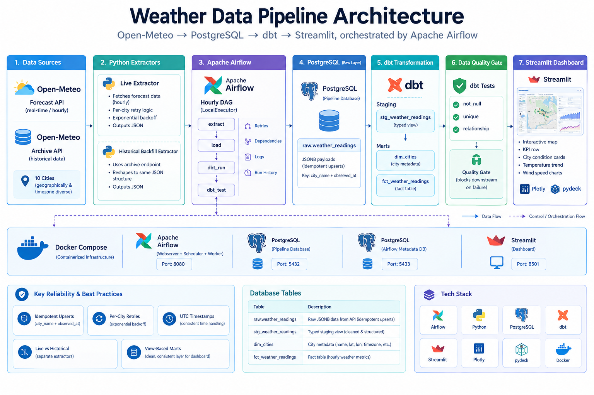
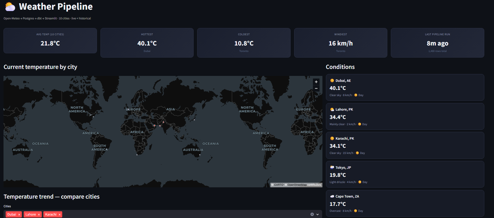
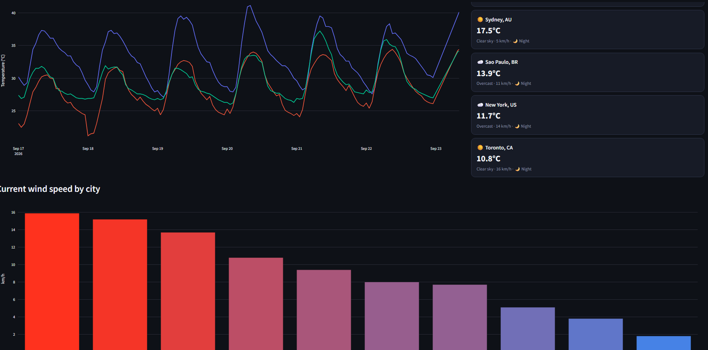
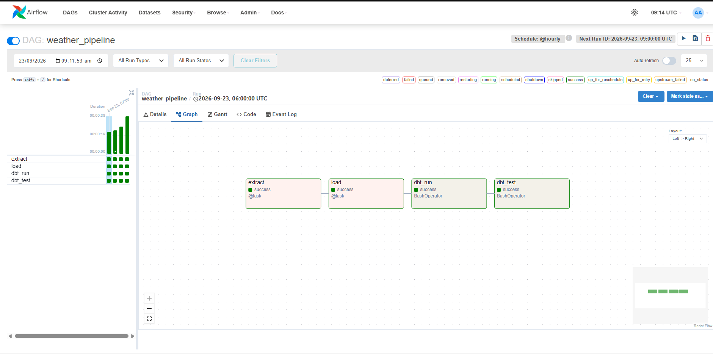

# Weather Data Pipeline

An end-to-end real-time fully automated data pipeline that pulls live weather for 10 cities worldwide from the Open-Meteo API, loads it into PostgreSQL, transforms it into clean analytical models with dbt, and serves it through an interactive Streamlit dashboard — all orchestrated by Apache Airflow.

[](https://www.python.org/)
[](https://www.postgresql.org/)
[](https://www.getdbt.com/)
[](https://airflow.apache.org/)
[](https://streamlit.io/)
[](https://www.docker.com/)

---

## 📋 Overview

This pipeline automatically:

1. **Polls** the Open-Meteo forecast API every hour for 10 geographically and timezone-diverse cities
2. **Loads** the raw JSON response into PostgreSQL as-is, keyed on `(city_name, observed_at)` with `ON CONFLICT DO NOTHING` for idempotent inserts
3. **Transforms** the raw JSONB into typed staging and mart models with **dbt** — flattening temperature, windspeed, wind direction, weather code, and day/night status
4. **Supports historical backfills** via a separate archive-endpoint extractor that reshapes historical hours into the same JSON structure the live extractor produces, so one staging model handles both
5. Serves the results through a **Streamlit dashboard** — an interactive map, per-city condition cards, and multi-city temperature trend comparisons
6. Is fully orchestrated end-to-end by **Apache Airflow** (hourly schedule, per-task retries, dependency-aware DAG), replacing an earlier Windows Task Scheduler implementation

This mirrors how real data teams build monitoring pipelines for anything that changes over time and needs both a live view and historical trend analysis — the same pattern applies to IoT sensor data, stock prices, or application metrics.

---

## 🏗️ Architecture

**Open-Meteo API** → **Extract (Python)** → **PostgreSQL (raw)** → **dbt (staging/marts)** → **Streamlit Dashboard**

| Stage             | Purpose                                          | Format         | Storage                             |
|-------------------|---------------------------------------------------|----------------|--------------------------------------|
| **Raw ingestion** | Live/historical weather pulled per city            | JSON           | Postgres (`raw.weather_readings`)     |
| **Staging**       | Flattens raw JSONB into typed columns               | Typed rows     | dbt view (`stg_weather_readings`)     |
| **Marts**         | Analysis-ready fact/dimension tables                | Typed rows     | dbt view (`fct_weather_readings`, `dim_cities`) |
| **Serving**       | Dashboard reads directly from marts                 | Query results  | Streamlit (no dependency on Airflow)  |

### Architecture Diagram

<!-- Drop architecture_diagram.png into images/ -->


### Tech Stack

- **Ingestion:** Python `requests`, per-city retry logic with exponential backoff against the Open-Meteo forecast API
- **Historical data:** Separate backfill script against Open-Meteo's archive endpoint, reshaped into the live extractor's JSON structure
- **Storage:** PostgreSQL — raw JSONB landing table, untouched by application code
- **Transformation:** dbt — staging model flattens JSON, marts (`dim_cities`, `fct_weather_readings`) materialized as **views** (not tables) so the dashboard never hits a lock during an hourly rebuild
- **Orchestration:** Apache Airflow (LocalExecutor) — `extract → load → dbt_run → dbt_test`, hourly schedule, per-task retries, full run history and logs in the UI
- **Dashboard:** Streamlit + Plotly + pydeck — interactive map, KPI row, per-city condition cards, temperature trend and wind speed charts
- **Containerization:** Docker Compose — separate Postgres instances for pipeline data and Airflow metadata

---

## 📊 Dashboard Output

<!-- Drop dashboard screenshots into images/ -->



---

## 🔄 Pipeline Flow (Airflow DAG)

```
extract (poll Open-Meteo for 10 cities)
        │
        ▼
load (upsert into raw.weather_readings)
        │
        ▼
dbt_run (build staging + mart models)
        │
        ▼
dbt_test (schema + data quality checks)
        │
        ▼
Streamlit Dashboard (reads from marts)
```

Each task carries its own retry policy and logs independently in the Airflow UI, rather than one shell script failing or succeeding as a single unit. `dbt_test` only runs if `dbt_run` succeeds, so a broken build never silently reaches the dashboard.

<!-- Drop a Grid/Graph view screenshot into images/ -->


---

## 🗂️ Database Tables

| Table                    | Description                                                                              |
|---------------------------|-------------------------------------------------------------------------------------------|
| `raw.weather_readings`    | Untouched raw JSON payloads per city per hour, `source` distinguishes live vs. backfilled |
| `stg_weather_readings`    | Flattened, typed staging view — temperature, windspeed, wind direction, weather code      |
| `dim_cities`               | City reference dimension (name, country, lat/lon)                                         |
| `fct_weather_readings`     | Analysis-ready fact table joining staging to city dimension                               |

---

## ✅ Data Validation & Reliability

- **Idempotent upserts** — `UNIQUE (city_name, observed_at)` with `ON CONFLICT DO NOTHING`, so reruns never duplicate rows
- **Per-city retries** — one city's flaky API call doesn't cost the other nine that hour
- **dbt schema tests** — `not_null`, `unique`, and relationship checks run automatically after every build, gating the dashboard from broken data
- **View-based marts** — avoids exclusive table locks during hourly rebuilds colliding with dashboard reads
- **Explicit UTC timestamps** — avoids the "negative minutes ago" class of bug caused by mixing local-time and UTC timestamps in the same column
- **Live/historical source separation** — dashboard "current conditions" query filters to `source = 'open-meteo'` only, so backfilled archive rows are never mistaken for live data

---

## 📁 Repository Structure

```
weather-pipeline/
├── README.md
├── docker-compose.yml
├── requirements.txt
├── .env.example
│
├── dags/
│   └── weather_pipeline_dag.py      # Main Airflow DAG
│
├── sql/
│   └── schema.sql                   # raw.weather_readings
│
├── src/
│   ├── extract/
│   │   ├── fetch_weather.py         # Live extractor
│   │   ├── backfill.py              # Historical archive extractor
│   │   └── cities.py                # 10 tracked cities
│   ├── load/
│   │   └── load_to_postgres.py      # Idempotent upsert logic
│   └── utils/
│       ├── db.py
│       └── logger.py
│
├── dbt_project/
│   ├── dbt_project.yml
│   ├── models/
│   │   ├── staging/
│   │   │   └── stg_weather_readings.sql
│   │   └── marts/
│   │       ├── dim_cities.sql
│   │       └── fct_weather_readings.sql
│   └── seeds/
│       └── cities.csv
│
├── dashboard/
│   └── app.py                       # Streamlit dashboard
│
└── tests/
    └── test_fetch_weather.py
```

---

## ⚙️ Configuration

The pipeline is parameterized via environment variables, so no credentials are hardcoded in application code.

**Create a `.env` file in the project root and add:**

```
POSTGRES_USER=your_user
POSTGRES_PASSWORD=your_password
POSTGRES_DB=your_db
POSTGRES_PORT=5432
```

Airflow's own metadata database and the pipeline's application database are **deliberately kept separate** so pipeline data never mixes with Airflow's internal state.

---

## 🚀 Getting Started

```
# Clone the repo
git clone https://github.com/Ayan-Ahmad-0/weather-pipeline.git
cd weather-pipeline

# Create a .env file in the project root with your Postgres credentials

# Build and start everything (Postgres, Airflow, Streamlit)
docker compose up -d airflow-init
docker compose up -d
```

| Service              | URL                        |
|-----------------------|------------------------------|
| Airflow UI            | <http://localhost:8085>     |
| Streamlit Dashboard   | <http://localhost:8501>     |
| Postgres              | `localhost:5432` (db: your `POSTGRES_DB`) |

---

## 🚧 Challenges Solved

- Migrated orchestration from Windows Task Scheduler (`schtasks` + a shell script) to Apache Airflow for real DAG-level dependency tracking, per-task retries, and run history — instead of a single script that either fully succeeds or fully fails with no visibility into which step broke
- Fixed a dashboard `DatabaseError: canceling statement due to statement timeout` by switching dbt marts from `+materialized: table` to `+materialized: view`, so hourly rebuilds no longer take an exclusive lock the dashboard could collide with
- Fixed a negative "last pipeline run" time caused by requesting `timezone: auto` from Open-Meteo (local time, no UTC offset) into a `TIMESTAMPTZ` column — switched to explicit UTC on every extractor
- Diagnosed the dashboard showing stale/wrong temperatures after a data reload — traced to the archive/backfill endpoint returning forecast-filled future hours that beat genuine live readings in a combined sort; fixed by filtering "current conditions" to live-source rows only
- Resolved a `dbt-postgres`/`dbt-core` version mismatch (`No module named 'dbt.adapters.postgres'`) by leaving both packages unpinned so pip resolves compatible versions together

---

## 🛠️ Future Improvements

- Dynamic per-city task mapping in Airflow, so one city's API failure retries in isolation instead of retrying the full extract batch
- Add alerting hooks (Slack/email) on DAG task failure
- Expand tracked cities and add seasonal/climate comparison views to the dashboard